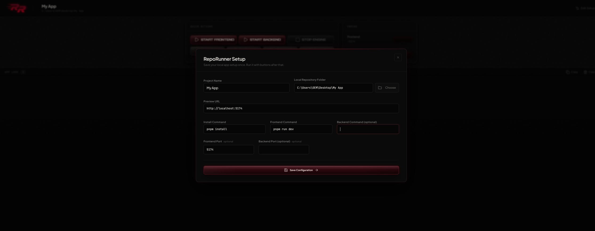
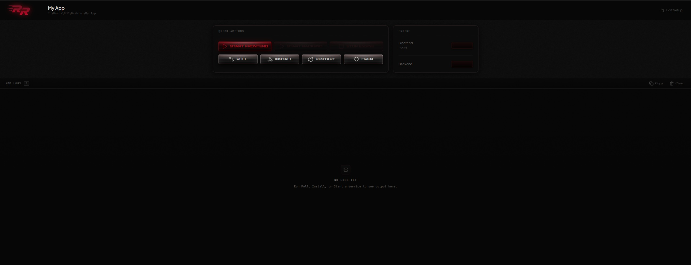
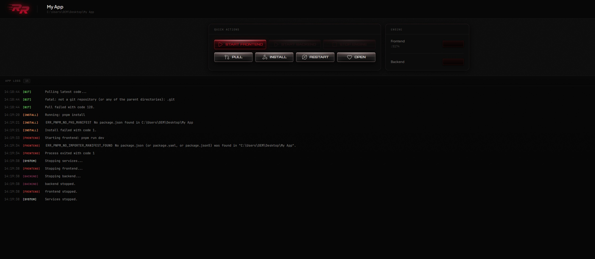

# RepoRunner

> Import your repo once. Save the run setup once. Then pull, install, start, stop, restart, open preview, and inspect logs with buttons.

RepoRunner is a desktop-style app for AI-assisted builders, vibe coders, and solo founders who want to run local GitHub repos without juggling terminals. Save your project config once, then drive everything with a button panel.

---

## Who it's for

- **AI-assisted builders** — you got a repo from Cursor, Replit, or Claude and just need to run it
- **Vibe coders** — you want to ship, not manage shells
- **Solo founders** — one project, one panel, no terminal context switching
- **Anyone running a local repo** who doesn't want Git Bash, npm scripts, and two terminal windows open simultaneously

RepoRunner is **not** an IDE, a deployment tool, or an AI debugging assistant.

---

## Current status

Early version — first public build. Core workflow is functional. Single-project only. See [limitations](#current-limitations) below.

---

## Features

- Save one local project profile (repo path, commands, ports, preview URL)
- **Pull latest** — runs `git pull` in your repo directory
- **Install** — runs your install command (e.g. `npm install`)
- **Start Frontend** — starts your frontend dev server
- **Start Backend** — starts your backend server
- **Stop Engine** — stops both frontend and backend services
- **Restart All** — sequentially restarts backend then frontend
- **Open Preview** — opens your configured preview URL in a browser
- **View live logs** — colored by source (git / install / frontend / backend / system)
- **Copy logs** — copies full log output to clipboard
- **Clear logs** — clears the log panel
- **Edit Setup** — reopen the config modal at any time without losing running services

---

## Usage

1. Open the app — the setup modal appears on first launch
2. Fill in your project details:
   - Project name and local repo folder path
   - Preview URL (e.g. `http://localhost:3000`)
   - Install, frontend, and backend commands
   - Frontend and backend ports (optional, used for port readiness checks)
3. Click **Save Configuration** — the dashboard loads
4. Use Quick Actions:
   - **Pull** to fetch latest code
   - **Install** to run your install command
   - **Start Frontend / Start Backend** to spin up services
   - **Stop Engine** to kill everything cleanly
   - **Restart** to do a full stop → start cycle
   - **Open** to launch your preview URL
5. Watch the log panel for real-time output from each service
6. Click **Edit Setup** (gear icon in the header) to adjust config at any time

---

## Screenshots

**Setup screen** — configure your project once



**Dashboard** — Quick Actions, Engine panel, and log output





---

## Tech stack

| Layer              | Technology                            |
| ------------------ | ------------------------------------- |
| UI                 | React + Vite + TypeScript             |
| Styling            | Tailwind CSS v4 + shadcn/ui           |
| Desktop            | Electron                              |
| Forms              | react-hook-form + Zod                 |
| Fonts              | Plus Jakarta Sans + JetBrains Mono    |
| Process management | Node.js `child_process` + `tree-kill` |
| Port detection     | `tcp-port-used`                       |
| Config storage     | Electron `app.getPath('userData')`    |
| Web preview        | Browser mock via `window.repoRunner`  |

---

## Local development

### Prerequisites

- Node.js 18+
- pnpm 8+

### Install dependencies

```bash
pnpm install
```

### Run web preview (browser mock — no Electron required)

```bash
pnpm --filter @workspace/reporunner run dev
```

The script supplies the local Vite defaults (`PORT=5173` and `BASE_PATH=/`) in a Windows-safe way. Open the URL shown in your terminal. The browser mock simulates all IPC calls so you can develop the UI without Electron. Project config is persisted via `localStorage` in this mode.

### Typecheck

```bash
pnpm --filter @workspace/reporunner run typecheck
```

### Run as Electron desktop app

```bash
pnpm --filter @workspace/reporunner run electron:dev
```

`electron:dev` is the recommended local desktop workflow on Windows, macOS, and Linux. It compiles the Electron main process, starts Vite on port `5173` with `BASE_PATH=/`, waits for Vite to accept connections, then launches Electron with `NODE_ENV=development`.

If you need to run the pieces separately for debugging, use:

```bash
# Terminal 1: Vite browser/renderer dev server
pnpm --filter @workspace/reporunner run dev

# Terminal 2: Electron main process build
pnpm --filter @workspace/reporunner run electron:build-main

# Terminal 2: launch Electron after the build finishes
# PowerShell
$env:NODE_ENV="development"; pnpm --filter @workspace/reporunner exec electron .; Remove-Item Env:NODE_ENV
```

On Windows PowerShell, avoid Unix-style inline environment assignments such as `NODE_ENV=development ...`; the package scripts above set the needed environment variables for the recommended workflow.

### Build for distribution

```bash
pnpm --filter @workspace/reporunner run electron:dist
```

Output goes to `artifacts/reporunner/release/`. Targets: `.dmg` (macOS), `.exe` / NSIS (Windows), `.AppImage` (Linux).

### Replit note

This repo lives inside a pnpm monorepo. The Replit web preview runs the Vite dev server with the browser mock — real process management requires the Electron build.

---

## Project structure

```
artifacts/reporunner/
├── electron/               # Electron main process
│   ├── main.ts             # Entry point
│   ├── preload.ts          # Exposes window.repoRunner to renderer via contextBridge
│   ├── ipc.ts              # IPC handlers (pull, install, start, stop, restart...)
│   ├── processManager.ts   # Spawns and kills service processes
│   ├── portManager.ts      # Port readiness checks (tcp-port-used)
│   └── projectStore.ts     # Reads/writes project profile to disk
├── src/                    # React renderer
│   ├── components/
│   │   ├── Dashboard.tsx   # Main app view (quick actions, engine panel, logs)
│   │   ├── SetupScreen.tsx # Project config form
│   │   └── CommandButton.tsx
│   ├── mock/
│   │   └── repoRunnerMock.ts  # Browser mock of window.repoRunner
│   ├── types.ts            # Shared TypeScript types (RepoRunnerAPI, ProjectProfile, etc.)
│   └── App.tsx             # Root component and state machine
├── electron-dist/          # Compiled Electron JS (git-ignored)
├── dist/                   # Vite build output (git-ignored)
└── release/                # electron-builder output (git-ignored)
```

---

## V0 test checklist

- [ ] Save project config
- [ ] Reopen app and confirm config persists
- [ ] Pull latest
- [ ] Run install
- [ ] Start frontend
- [ ] Start backend
- [ ] Stop engine
- [ ] Restart all
- [ ] Open preview
- [ ] Copy logs
- [ ] Clear logs
- [ ] Edit setup (gear icon in header)
- [ ] Close edit without saving (X button)

---

## Current limitations

- **Single project only** — no project switcher yet
- **No process health checks** — if a process crashes silently, the engine light stays on
- **No env var injection** — commands that require `.env` values must have them baked into the command string or the shell environment
- **Browser preview only** — the Replit web preview runs the browser mock; real process management requires the Electron build

---

## License

MIT — see root `package.json`. No `LICENSE` file present yet; one will be added before a formal release.
